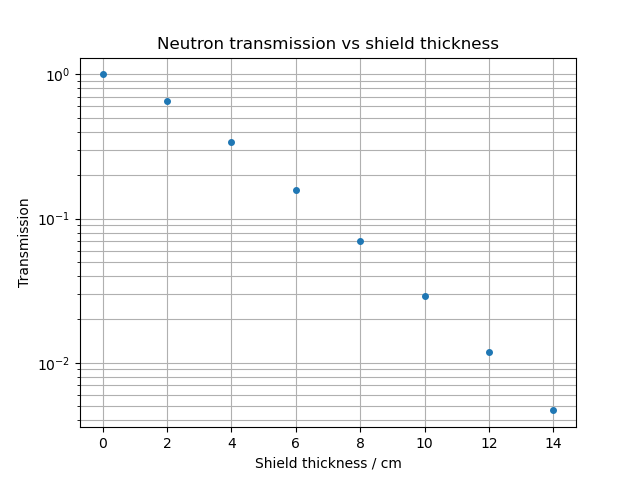

# neutron-shielding-openmc

## Overview

Python-based OpenMC model for investigating neutron attenuation through different shielding materials and the effect of material thickness and layered shielding configurations on neutron flux.

The model file allows users to:

- Investigate neutron attenuation whith varying the shielding thickness.
- Compare the attenuation of different shielding materials.
- Calculate the transmission relative to an unshielded reference.
- Estimate the statistical uncertainty in the calculated neutron flux and transmission.
- Investigate the effect of the positional order of materials when shielding against neutrons.

## Model Description

The model is simplistic, it contains a neutron source at fixed energy, an air region, a shielded region and a detector region.
The shielding region can contain one or more materials, allowing different shielding configurations to be investigated.
The neutron flux is calculated at the detector region using an OpenMC cell tally.

When running the program, the user can edit:

- Shielding material
- Shielding material thickness
- Shielding layer order
 
By changing global parameters in the model file, the user can edit:
- Source energy
- Detector position
- Number of particle histories
- Number of batches
 
## Materials

The model currently includes materials for:

- Concrete
- Water
- Steel
- Air
 
## Methodology

### Attenuation (Analysis mode 1)

For a selected shielding material, the model can be run over a range of shielding thicknesses.

For each tickness, the neutron flux and statistical uncertainty are recorded.

Transmission is calculated relative to teh zero shielding case:

$T(x) = \frac{\phi(x)}{\phi(0)}$

where:

- $\(T(x)\)$ is the transmission through a shield of thickness $\(x\)$
- $\(\phi(x)\)$ is the neutron flux with shielding
- $\(\phi(0)\)$ is the neutron flux with no shielding

### Multilayered Shielding (Analysis mode 2)

This analysis mode allows materials to be combined into a layered shield.

The order and thickness of the materials is chosen by the user in the terminal.

The ouput will tell the user the neutron flux past the shielded material combination.

## Results

Example ouput of attenuation analysis mode 1:




The transmission plot uses a logarithmic vertical axis to show the attenuation over a wider range of shield thicknesses.

## Statistical uncertainty

OpenMC uses Monte Carlo sampling to estimate the neutron transport through the materials.

The calculated fluc therefore has an associated uncertainty which is recorded alongside the calculated flux.

When calculating transmission, the uncertainty in both the shielded and reference fluxes is included.

These uncertainties represent statistical uncertainty from the Monte Carlo simulation and do not account for uncertainties associated with the physical model, material composition or nuclear data.

## Assumptions and Limitations

This project is a simple set up rather than a detailed engineering or nuclear safety assessment. It is a basic foundation to build more complex geometries and radioactive sources.

The main assumptions and limitations are:

- The neutron source is monoenergetic.
- A fixed-source Monte Carlo calculation is used.
- The shielding materials use simplified representative compositions.
- The outer model boundaries are treated as vacuum boundaries.
- Modelling uncertainties are not assessed.
- The model represents a simplified hypothetical geometry.

## Requirements

The project requires:

- Python
- OpenMC
- NumPy
- Matplotlib
- A compatible OpenMC nuclear data library

The nuclear data files are not included in this repository.

## Setup

Install the required Python packages and OpenMC according to the OpenMC documentation.

The `OPENMC_CROSS_SECTIONS` environment variable must point to the location of the OpenMC cross-section library.

For example:

```bash
export OPENMC_CROSS_SECTIONS="/path/to/cross_sections.xml"


  
