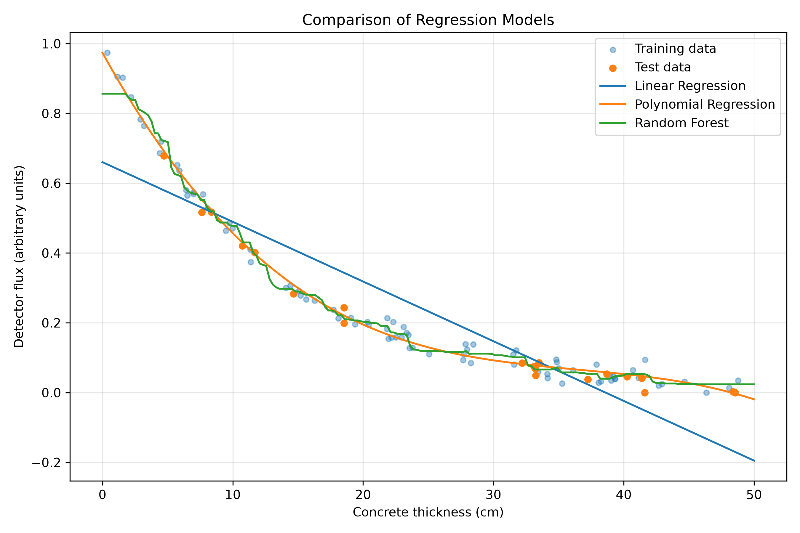
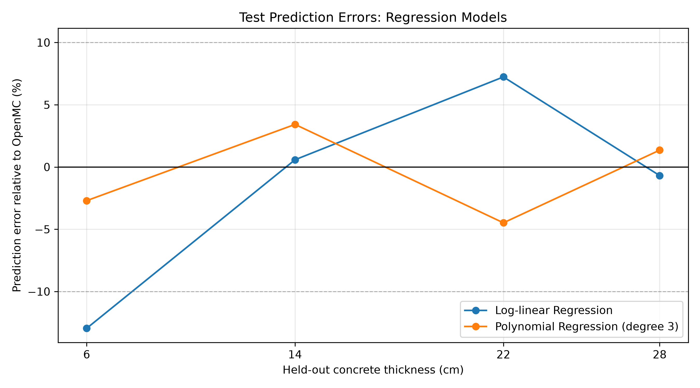
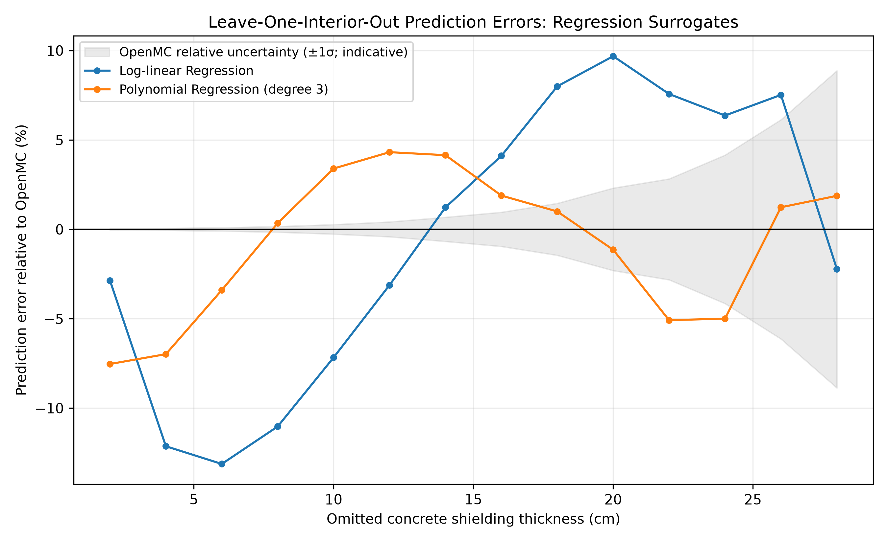

# Machine Learning Surrogate for Neutron Shielding

## Project Overview

This project investigates the use of machine learning to approximate neutron detector flux predictions generated by the **OpenMC Monte Carlo particle transport code**.

Monte Carlo methods provide a powerful approach to modelling neutron transport, but repeated simulations can be computationally expensive. Machine learning surrogate models offer a potential alternative by learning relationships between simulation inputs and outputs, allowing predictions to be generated without running a new transport calculation for every configuration.

This study uses OpenMC-generated data to train and evaluate three regression models for predicting neutron attenuation through concrete shielding.

The project demonstrates:

* Monte Carlo neutron transport simulation and data generation.
* Python-based data processing and regression modelling.
* Model evaluation using withheld simulation results.
* Cross-validation and quantitative prediction error analysis.
* Consideration of statistical uncertainty and model limitations.

The surrogate extends the [main OpenMC neutron shielding project](../README.md).

## 1. Simulation Data

Training data were generated using a fixed-source OpenMC model containing a neutron source, concrete shielding region and downstream detector tally region.

Concrete shielding thickness was varied between **0 and 50 cm**, in increments of 2 cm, producing 26 simulation configurations.

For each configuration, the simulation recorded:

| Variable       | Description                                  |
| -------------- | -------------------------------------------- |
| `thickness_cm` | Concrete shielding thickness (model input)   |
| `flux`         | Detector-cell neutron flux tally estimate    |
| `uncertainty`  | Monte Carlo tally standard deviation         |
| `transmission` | Detector flux relative to the 0 cm reference |

The detector tally is normalised per source particle. It should not be interpreted as an absolute physical flux in neutrons/cm²/s without appropriate volume and source-strength normalisation.

The complete dataset is available in [`data/openmc_attenuation_data.csv`](data/openmc_attenuation_data.csv).

### Dataset Selection

The surrogate analysis focuses on **0–30 cm**, comprising 16 simulation configurations.

At larger shielding thicknesses, relatively few simulated neutron histories contribute to the detector tally, resulting in increased statistical uncertainty. The maximum relative tally uncertainty within the selected 0–30 cm subset is approximately 13.3%.

The full 0–50 cm dataset is retained for future investigation.

## 2. Machine Learning Methodology

### Input and Target

The surrogate uses a single input feature:

* **Input:** Concrete shielding thickness (cm)
* **Target:** Base-10 logarithm of the OpenMC detector flux tally

The logarithmic transformation was selected because the detector flux decreases by several orders of magnitude as shielding thickness increases.

Predictions are transformed back to the original flux scale for evaluation.

### Regression Models

Three models were implemented using scikit-learn.

**Log-linear regression**

A linear model is fitted to the logarithm of detector flux. This provides a simple, physically motivated baseline because neutron attenuation can often be approximated by an exponential relationship.

**Cubic polynomial regression**

A third-degree polynomial is fitted to logarithmic detector flux. This allows the model to capture deviations from a simple exponential attenuation relationship.

**Random forest regression**

An ensemble of decision trees is trained to capture nonlinear relationships without imposing a specified functional form. Its performance is compared with the simpler regression methods.

## 3. Initial Train/Test Evaluation

An initial evaluation withheld four intermediate shielding thicknesses (6, 14, 22 and 28 cm) from training.

The remaining 12 configurations were used for training, including both endpoints of the 0–30 cm interval. This evaluates **interpolation within the simulated thickness range**, rather than extrapolation beyond it.

| Model                           |    Test R² | Test MAPE |
| ------------------------------- | ---------: | --------: |
| Log-linear regression           |     0.9770 |      5.4% |
| **Cubic polynomial regression** | **0.9990** |  **3.0%** |
| Random forest                   |     0.9540 |    248.0% |

The cubic polynomial model produced the lowest relative prediction error on the four withheld configurations.

### Model Predictions



*Regression predictions compared with OpenMC detector flux estimates on a logarithmic vertical scale. OpenMC markers include Monte Carlo statistical uncertainty.*

### Prediction Errors



*Percentage prediction errors for log-linear and cubic polynomial regression at the four withheld thicknesses.*

The results indicate that both regression models reproduce the attenuation trend reasonably well, while the random forest produces larger relative errors, particularly at low detector flux.

## 4. Cross-Validation

To assess performance beyond a single train/test split, **leave-one-interior-thickness-out cross-validation** was implemented.

Each of the 14 intermediate shielding thicknesses was withheld in turn. A new model was fitted to the remaining 15 configurations and used to predict the omitted result.

The 0 cm and 30 cm endpoints remained in every training set to preserve an interpolation-only evaluation.

### Cross-Validation Results

| Model                           | Mean Absolute Percentage Error | Log₁₀ MAE (dex) |         R² |
| ------------------------------- | -----------------------------: | --------------: | ---------: |
| Log-linear regression           |                          6.87% |          0.0302 | **0.9946** |
| **Cubic polynomial regression** |                      **3.38%** |      **0.0149** |     0.9934 |
| Random forest                   |                        137.33% |          0.3922 |     0.1227 |

Cubic polynomial regression achieved the lowest average relative prediction error, with a **MAPE of 3.38% across 14 withheld configurations**.

Log-linear regression also performed well and achieved a slightly higher R². This demonstrates the importance of considering multiple evaluation metrics: R² on the original flux scale and percentage-based errors emphasise different aspects of predictive performance.

Random forest regression performed substantially worse in relative terms, reflecting the difficulty of representing a smooth attenuation relationship using a small dataset and piecewise-constant tree predictions.

### Cross-Validation Prediction Errors



*Prediction errors for log-linear and polynomial regression across the 14 withheld configurations. The shaded region represents the indicative ±1 standard deviation relative uncertainty of the corresponding OpenMC tally estimate, not a surrogate prediction confidence interval.*

The detailed cross-validation predictions and performance metrics are available in:

* [`cross_validation_summary.csv`](cross_validation_summary.csv)
* [`cross_validation_predictions.csv`](cross_validation_predictions.csv)

## 5. Running the Analysis

### Requirements

* Python 3.11 or a compatible Python version
* NumPy
* pandas
* Matplotlib
* scikit-learn

Install the machine learning dependencies from the repository root:

```bash
pip install -r ml_surrogate/requirements.txt
```

The published OpenMC dataset is included in the repository, so **OpenMC does not need to be installed to reproduce the machine learning analysis**.

OpenMC and a compatible nuclear data library are required only when generating new simulation results.

### Model Comparison

From the repository root, run:

```bash
python ml_surrogate/compare_models.py
```

This generates model performance metrics, held-out predictions and comparison plots.

### Cross-Validation

Run:

```bash
python ml_surrogate/cross_validate.py
```

This generates the cross-validation performance summary, individual predictions and prediction error plots.

Both scripts use the supplied dataset at:

```text
ml_surrogate/data/openmc_attenuation_data.csv
```

## 6. Limitations

This is an exploratory surrogate modelling study and is not intended for validated shielding design or nuclear safety calculations.

Current limitations include:

* **Small dataset:** Only 16 simulation configurations are used for surrogate training and evaluation.
* **Single input feature:** The current surrogate varies concrete thickness only. Shielding material, source energy and geometry are not included as independent model inputs.
* **Interpolation only:** The validation results do not establish accuracy outside the 0–30 cm range.
* **Monte Carlo uncertainty:** The reference OpenMC results have statistical uncertainties, particularly at larger shielding thicknesses.
* **Simplified physics model:** The underlying simulation uses representative material definitions and a simplified geometry rather than a validated engineering configuration.
* **Limited external validation:** The surrogate has not been tested against experimental measurements or an independent transport benchmark.

The cross-validation results assess the ability of regression models to reproduce the simulation output, not the physical accuracy of the underlying OpenMC model.

## 7. Potential Future Development

Potential extensions include:

* Introducing shielding material and neutron source energy as additional model inputs.
* Generating a larger simulation dataset covering a wider parameter space.
* Investigating improved Monte Carlo sampling or variance-reduction methods for thicker shielding.
* Evaluating alternative surrogate approaches and uncertainty-aware regression techniques.
* Comparing surrogate execution times against OpenMC transport simulations.

## Conclusion

This study demonstrates that a relatively simple regression surrogate can reproduce the detector flux attenuation trend generated by a Monte Carlo neutron transport model.

Cubic polynomial regression achieved a mean absolute percentage error of **3.38%** across 14 withheld configurations, demonstrating promising interpolation performance for this simplified problem.

The project combines computational physics, simulation automation, machine learning and statistical validation while highlighting the importance of understanding the limitations of data-driven engineering predictions.
